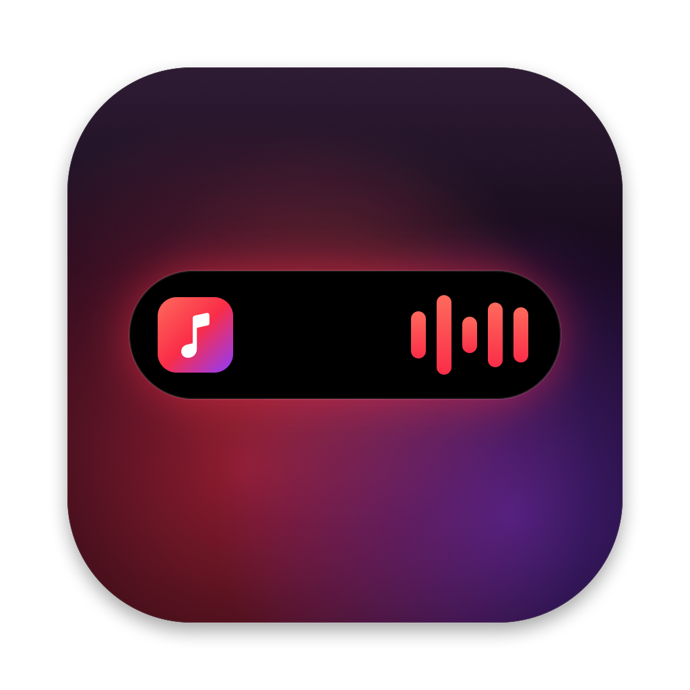
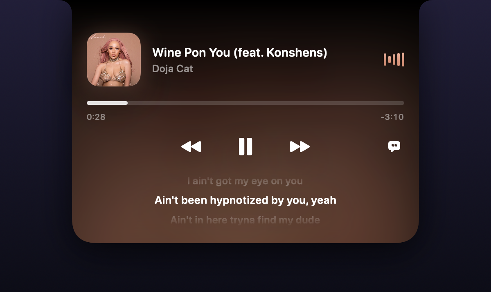
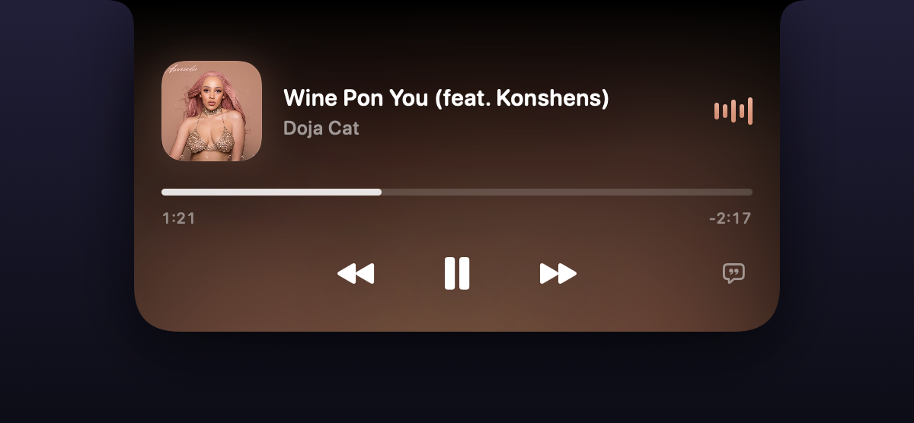

<p align="center">
  
</p>

<h1 align="center">Music Island</h1>

<p align="center">A Dynamic Island for Apple Music, living in your MacBook's notch.</p>

<p align="center">
  
</p>

## What it does

- **At the notch:** a small album cover and animated level bars sit on either side of the notch while a song is loaded. While paused, the cover dims and the bars flatten.
- **Hover to open:** hovering the notch springs open a card with the artwork, title and artist, a scrubber you can drag, and back / play-pause / next controls. The background glows with the album art.
- **Synced lyrics:** turn them on with the speech-bubble button. The current line is lit in the middle, with the lines before and after dimmed, and the lines glide up in time with the song.
- **Song changes:** when the song changes while the island is closed, it briefly drops down to show the new title and artist.
- **Launch at login:** available from the ♪ menu bar icon.

| Open card | With lyrics |
|---|---|
|  |  |

| Playing | Paused |
|---|---|
|  |  |

## Requirements

- macOS 14 or later. It's designed for MacBooks with a notch; on other screens it draws a small virtual one.
- The Apple Music app.
- The Swift 6 toolchain or later to build. The Command Line Tools are enough; you don't need full Xcode.

## Install

```sh
git clone https://github.com/TusharAbhinav/music-island.git
cd music-island
./build.sh install
```

This builds the app, copies it to `/Applications/Music Island.app` and launches it. Run the same command again after pulling changes. `./build.sh` on its own builds into `build.noindex/` without installing.

The first time a song plays, macOS asks to let Music Island control Music. Click **Allow**, or the island stays empty.

## How it works

- **Reading the player:** the app reads what's playing and controls playback through AppleScript. It listens for Music's `playerInfo` notification and also checks every 2 seconds. Between checks, the playback position is calculated locally so the scrubber moves smoothly.
- **Album art:** comes from Music. For streamed songs that Music doesn't expose it for, the app looks up the cover on the iTunes Search API.
- **Lyrics:** come from [LRCLIB](https://lrclib.net), a free database of timed lyrics. When both a native-script and a romanized version exist (for example Hindi in Devanagari vs. in Latin letters), the native script is shown.
- **The window:** it sits above the menu bar and never becomes the active window, so it doesn't take focus from the app you're using. Because of that, the app handles clicks and hover itself instead of relying on SwiftUI gestures.

## Privacy

- **Song details sent out:** the title and artist of the current song go to Apple's iTunes Search API, and only when Music doesn't provide the cover.
- **Lyrics lookups:** go to LRCLIB, and only while lyrics are switched on.
- **Everything else:** nothing else leaves your Mac.

## Project layout

| Path | What's there |
|---|---|
| `Sources/MusicIsland/MusicIslandApp.swift` | App entry point, the notch window, menu bar item, mouse tracking |
| `Sources/MusicIsland/IslandViewModel.swift` | Open/close states, sizes, hover and click handling |
| `Sources/MusicIsland/IslandView.swift` | The island's SwiftUI views: notch shape, card, scrubber, controls, lyrics |
| `Sources/MusicIsland/MusicController.swift` | Talking to Music: status, commands, artwork, accent color |
| `Sources/MusicIsland/LyricsController.swift` | Fetching, matching and parsing lyrics |
| `scripts/make-icon.swift` | Draws the app icon (`swift scripts/make-icon.swift out.png`) |
| `build.sh` | Builds and bundles the `.app`, and installs it with `install` |
